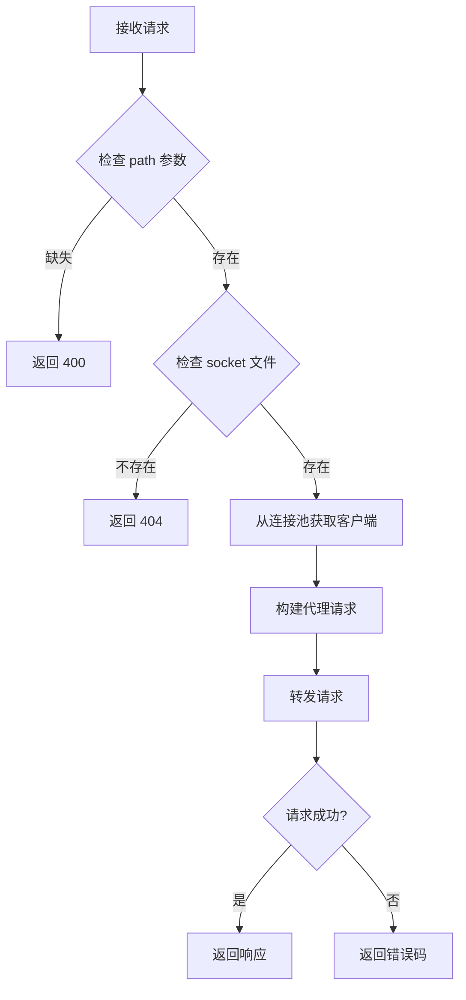
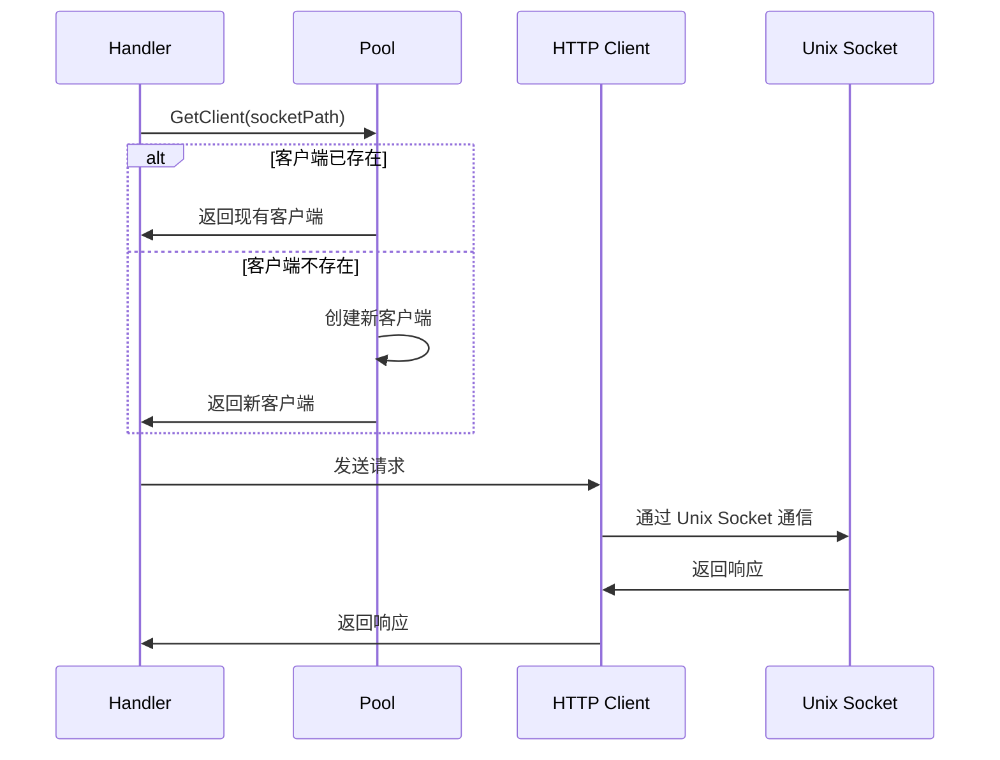

# 项目架构

<!--TOC-->

- [目录结构](#目录结构) `:19+19`
- [核心模块](#核心模块) `:38+108`
  - [1. 配置管理 (config.go)](#1-配置管理-configgo) `:40+16`
  - [2. HTTP 服务器 (server.go)](#2-http-服务器-servergo) `:56+15`
  - [3. 请求处理器 (handlers.go)](#3-请求处理器-handlersgo) `:71+26`
  - [4. 连接池 (pool.go)](#4-连接池-poolgo) `:97+41`
  - [5. CLI 命令 (command.go)](#5-cli-命令-commandgo) `:138+8`
- [错误处理](#错误处理) `:146+13`
- [技术栈](#技术栈) `:159+6`

<!--TOC-->

uds-proxy 采用清晰的分层架构设计，核心代码位于 `internal/` 目录。

## 目录结构

```
uds-proxy/
├── cmd/uds-proxy/
│   └── main.go              # 程序入口
├── internal/
│   ├── commands/uds-proxy/
│   │   └── command.go       # CLI 命令定义
│   └── proxy/
│       ├── config.go        # 配置结构体
│       ├── server.go        # HTTP 服务器
│       ├── handlers.go      # 请求处理器
│       └── pool.go          # 连接池管理
├── config/
│   └── default.example.yaml # 配置示例
└── docs/                    # 项目文档
```

## 核心模块

### 1. 配置管理 (`config.go`)

定义服务配置结构：

```go
type Config struct {
    Host         string        // 监听地址
    Port         int           // 监听端口
    PortFile     string        // 端口文件路径
    Timeout      time.Duration // 请求超时
    MaxConns     int           // 最大连接数
    MaxIdleConns int           // 最大空闲连接数
    NoAccessLog  bool          // 是否禁用访问日志
}
```

### 2. HTTP 服务器 (`server.go`)

负责：

- HTTP 服务器的创建和启动
- 中间件管理（访问日志）
- 优雅关闭处理
- 端口自动分配和文件写入

关键设计：

- 使用 `net.Listen` 支持端口 0 自动分配
- 访问日志中间件记录请求详情
- 支持优雅关闭，等待进行中的请求完成

### 3. 请求处理器 (`handlers.go`)

提供三个核心端点：

| 端点      | 方法 | 功能                   |
| --------- | ---- | ---------------------- |
| `/`       | GET  | 返回服务信息和使用说明 |
| `/health` | GET  | 健康检查               |
| `/proxy`  | ALL  | 核心代理功能           |

**代理处理流程：**



### 4. 连接池 (`pool.go`)

为每个 Unix Socket 维护独立的 HTTP 客户端连接池：

```go
type Pool struct {
    mu      sync.Mutex
    clients map[string]*http.Client
    config  *Config
}
```

**设计特点：**

- **线程安全**：使用 `sync.Mutex` 保护 map 访问
- **惰性创建**：首次访问时才创建客户端
- **连接复用**：复用 HTTP 客户端减少连接开销
- **可配置限制**：支持最大连接数和空闲连接数配置

**连接池工作原理：**



### 5. CLI 命令 (`command.go`)

使用 [urfave/cli v3](https://github.com/urfave/cli) 构建命令行接口：

- 支持 8 个配置标志
- 自动生成帮助信息
- 类型安全的参数解析

## 错误处理

采用纯网关模式，网关级错误只返回状态码，无响应体：

| 状态码      | 场景                    | 响应体       |
| ----------- | ----------------------- | ------------ |
| 2xx/4xx/5xx | 透传目标服务响应        | 目标服务响应 |
| 400         | 缺少必需的 `path` 参数  | 无           |
| 502         | Socket 不存在或连接失败 | 无           |
| 504         | 请求超时                | 无           |

> 设计原则：调用方通过状态码判断错误来源。有 body 为目标服务响应，无 body 为网关错误。

## 技术栈

- **语言**：Go 1.23
- **HTTP 框架**：Go 标准库 `net/http`
- **CLI 框架**：urfave/cli v3
- **依赖管理**：Go Modules
